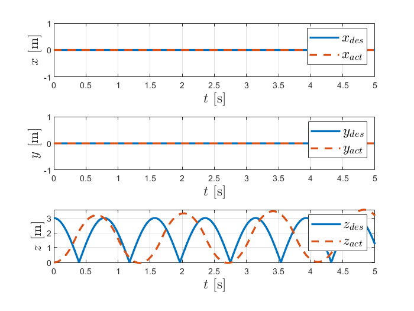
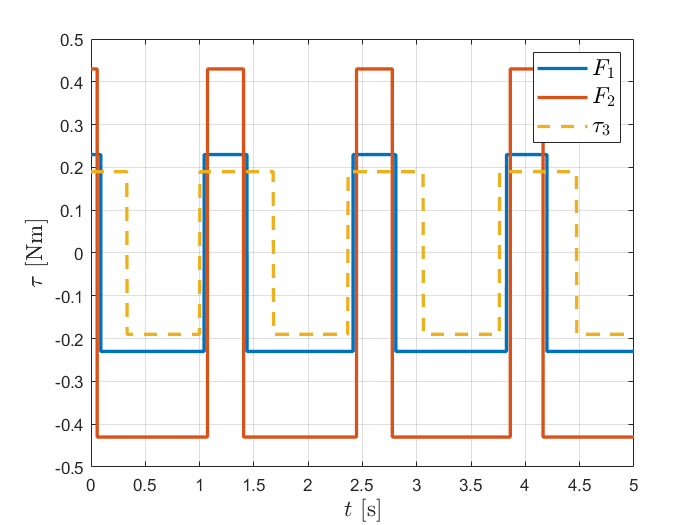

**Impedance Control**

```matlab:Code
%   Initial clearing of the screen and the memory
clear
clc
```

**Data **

```matlab:Code
m1 = 16.726;
m2 = 6.237;
m3 = 12.243;
l1 = 0.23;
l2 = 0.43;
l3 = 0.19;
w1 = 0.069;
w2 = 0.129;
w3 = 0.057;
kp = 700; ki = 100; kd = 250; % PID controller coeffitients 
AB = [l1 w1 w1]; % m dimensions of the first link
BC = [w2 w2 l2];
CD = [w3 w3 l3];
b = 0.1; % friction coefficient 

StopTime = 5; % simulation time 
% Data for the Repeating Sequence blocks 
time_values = [0 2 4 6 8 10 12 14 16];
p_des_x = [ 0  0  0 0 0 0 0  0  0];
p_des_y = [ 0  0  0 0 0 0 0  0  0];
p_des_z = [ -0.43  -0.42  -0.41 -0.33 -0.32 -0.31 -0.23  -0.22  -0.21];

```

  
### Run the section to run the model

\hfill \break

```matlab:Code
PPR_impedance % it opens the model 
simOut = sim('PPR_impedance');
```


```matlab:Code

```

### Plots 

\hfill \break

```matlab:Code
figure;
subplot(3,1,1);
plot(outputs.p_des.time, outputs.p_des.data(:,1),...
     outputs.p_act.time, outputs.p_act.data(:,1),'--', 'linewidth', 2);
grid on;
legend('$x_{des}$', '$x_{act}$',  'fontsize',14,'interpreter','latex');
ylabel('$x$ [m]', 'fontsize',14,'interpreter','latex');
xlabel('$t$ [s]', 'fontsize',14,'interpreter','latex');
subplot(3,1,2);
plot(outputs.p_des.time, outputs.p_des.data(:,2),...
     outputs.p_act.time, outputs.p_act.data(:,2),'--', 'linewidth', 2);
grid on;
legend('$y_{des}$', '$y_{act}$',  'fontsize',14,'interpreter','latex');
ylabel('$y$ [m]', 'fontsize',14,'interpreter','latex');
xlabel('$t$ [s]', 'fontsize',14,'interpreter','latex');
subplot(3,1,3);
plot(outputs.p_des.time, outputs.p_des.data(:,3),...
     outputs.p_act.time, outputs.p_act.data(:,3),'--', 'linewidth', 2);
grid on;
legend('$z_{des}$', '$z_{act}$',  'fontsize',14,'interpreter','latex');
ylabel('$z$ [m]', 'fontsize',14,'interpreter','latex');
xlabel('$t$ [s]', 'fontsize',14,'interpreter','latex');
```



  

**Plot of Torques and forces**

```matlab:Code

figure;
title('Joints torques');
plot(outputs.tau.time, outputs.tau.data(:,1),...
	 outputs.tau.time, outputs.tau.data(:,2),...
     outputs.tau.time, outputs.tau.data(:,3),'--', 'linewidth', 2);
grid on;
legend('$F_1$', '$F_2$', '$\tau_3$', 'fontsize',14,'interpreter','latex');
xlabel('$t$ [s]', 'fontsize',14,'interpreter','latex');
ylabel('$\tau$ [Nm]', 'fontsize',14,'interpreter','latex');
```


